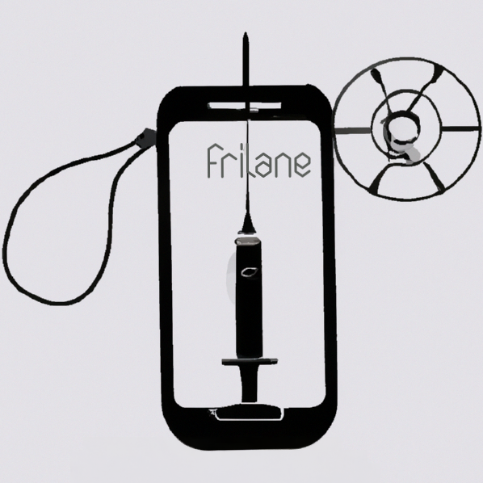

# Frilane
  

 

  
    
   <b>Automated iOS Frida Gadget injection and Testflight deployment using Frida and Fastlane</b>
    

## Configuration:

### Setup

Before you use this, you need to have access to an Apple Developer account as App Manager to create a new bundle ID and to generate an App Store Connect API key you must have Admin privileges.

1. Create a new repository [using this repositoriy as template](https://docs.github.com/en/repositories/creating-and-managing-repositories/creating-a-repository-from-a-template)
2. Create an empty private git repository to store the certificate, the encrypted p12 and provisioning profiles **¹** 
3. [Create a Personal access token](https://docs.github.com/en/authentication/keeping-your-account-and-data-secure/creating-a-personal-access-token)
4. [Create the below secrets](https://docs.github.com/en/actions/security-guides/encrypted-secrets#creating-encrypted-secrets-for-a-repository)

> 1. This is not required if you do not wish to use the Fastlane MATCH action ( comment it on the Fastfile). Not using the MATCH action, means that you will be creating a new certificate each time you run the workflow and eventually you will reach the allowed distribution certificates threshold and you will have to go on the App Store Connect to manually revoke them.

**DISCLAIMER** 
This workflow uses MacOS github hosted runner, please do read the terms about [billing for GitHub actions](https://docs.github.com/en/billing/managing-billing-for-github-actions/about-billing-for-github-actions)

### Secrets:

--------------

- ISSUERID - [App Store Connect Issuer ID](https://developer.apple.com/documentation/appstoreconnectapi/creating_api_keys_for_app_store_connect_api)
- KEY - [App Store Connect Key](https://developer.apple.com/documentation/appstoreconnectapi/creating_api_keys_for_app_store_connect_api)
- KEYID - [App Store Connect Key ID ](https://developer.apple.com/documentation/appstoreconnectapi/creating_api_keys_for_app_store_connect_api)

- MATCH_GIT_BASIC_AUTHORIZATION - Basic Auth to access the certs github repository - base64(user:personal_access_token) 
- MATCH_PASSWORD - password for the certificate encryption process
- MATCH_CERT_GIT_URL - Git repository to store the certificates - (https://github.com/your-certs-repo.git)
- MATCH_TEAM_ID - [App Store Team ID](https://developer.apple.com/help/account/manage-your-team/locate-your-team-id)

---------------
## Usage

Run the frilane workflow. 
Input options:
- verbose: verbosity | default: true | required: false
- gum-graft-all: gum-graft LC_FUNCTION_STARTS offsets | default: false | required: false
- gum-graft-offset: gum-graft custom offsets ex.["0x1231","0x3134"] | default: '' | required: false
- upgrade_gadget: choose wether to upgrade and compile the frida Gadget | default: false | required: false
- arch: Frida Gadget architecture (only if upgrade_gadget is set to true) | options: ['arm64','arm64e','arm64eoabi','x86_64-simulator','arm64-simulator'] |  default: 'arm64' | required: false        
- appleid: AppleID | required: true
- bundleid: BundleID | required: true
- buildtype: Build type | options: ['appstore','development'] |  default: 'appstore' | required: false     
- bundleversion: Bundle Version (increase each run) | default: '1.23.45' | required: true
- ipaurl ¹: URL of the IPA file to be patched | required: true

> 1. To serve the IPA file, you can combine [ngrok](https://ngrok.com/) and python http server module   

## How it works:

<ol type="1">
   <li><b>fastlane</b> environment configuration</li>
   <li>Runs <b>fastlane</b> lane get_certificate:</li>
      <ol type="a">
       <li>App connect api authentication</li>
       <li>CREATE_KEYCHAIN action to create a temporary keychain called frilane and unlock it</li>
       <li>MATCH action to fetch Codesign Certificate and p12 from private github repository (type: appstore / development) </li>
       <li>CERT and SIGH action to rename the cert and save it to file, generate provisioning profile and save to file. (Set to development if bundletype development is selected)</li>
       <li>obtains the signing identity and stores it in IOS_CERTID environment variable</li>
       <li>set the ACL on the keychain for codesigning</li>
      </ol>
  <li><b>OPTIONAL</b> Upgrading Frida Gadget (if <i>UPGRADE_GADGET</i> variable is set to 'true'):</li>
    <ol type="a">
       <li>clones latest frida github repository</li>
       <li>compiles Frida core-ios with <i>FRIDA_JAILBREAK=disabled</i></li>
       <li>MATCH action to fetch Codesign Certificate and p12 from private github repository</li>
       <li>CERT and SIGH action to rename the cert and save it to file, generate provisioning profile and save to file.</li>
       <li>obtains the signing identity and stores it in IOS_CERTID environment variable</li>
       <li>set the ACL on the keychain for codesigning</li>
      </ol>
  <li><b>OPTIONAL</b> Creates a arm64 framework from frida-gadget.dylib (if <i>UPGRADE_GADGET</i> variable is set to 'true')</li>
  <li><b>OPTIONAL</b> Uploads Frida.framework content as an artifact (if <i>UPGRADE_GADGET</i> variable is set to 'true')</li>
  <li>Download the IPA file to patch using the URL provided on the input options (ipaurl input parameter)</li>
  <li><b>OPTIONAL</b> Download gum-graft binary (if <i>GUM_GRAFT_ALL</i> is set to 'true' or <i>GUM_GRAFT_OFFSET</i> is not empty)</li>
  <li><b>OPTIONAL</b> Saves gum-graft custom offsets to file, to be processed by the Frilane bash script (if <i>GUM_GRAFT_OFFSET</i> is not empty)</li>
  <li>Executes frilane script</li>
    <ol type="a">
       <li>Prepare environment variables, folder and file paths</li>
       <li>Creates a temporary directory and extracts IPA file</li>
       <li>Executing gum-graft, two operating modes, Instrumentation of offsets from LC_FUNCTION_STARTS and Custom offsets (if <i>GUM_GRAFT_ALL</i> is set to 'true' or <i>GUM_GRAFT_OFFSET</i> is not empty)</li>
       <li>Copies SWIFT libs to the /SwiftSupport/iphoneos app directory</li>
       <li>Copy the framework directory to the app's Framework directory and load it using <i>INSERT_DYLIB_TOOL</i> (if <i>BUILD_TYPE</i> development, remove code_signign from config.json)</li>
       <li>Replaces CFBundleVersion and CFBundleShortVersion with <i>X_BUNDLE_VERSION</i> and <i>X_SHORT_BUNDLE_VERSION</i> provided on the input options</li>
       <li>Repacks IPA file</li>
      </ol>
  <li>fastlane resign_deploy</li>
    <ol type="a">
       <li>resign action to re-sign IPA, frameworks and libs using the codesign certificate imported during step 1</li>
       <li>pilot action to eploy the patched IPA to TestFlight (if <i>BUILD_TYPE</i> is 'appstore')</li>
   </ol>
   <li><b>OPTIONAL</b> Uploads patched IPA as an artifact that can be downloaded (if <i>BUILD_TYPE</i> is 'development')</li>
</ol>

## TODO

- Commit and push the Frida framework upgraded version
- Refactor workflow and code
- Convert frilane script to python
- Prepare for multiple context execution, Local and CI/CD

## Other Info

### Connecting to the Gadget

- Install [frida/frida-tools](https://frida.re/docs/installation/)
- Install [libimobiledevice](https://libimobiledevice.org/) (including usbmuxd)
- Start usbmuxd: `$ sudo usbmuxd -f -v`
- Connect the device via USB
- Pair the device using idevicepair: `$ idevicepair pair`
- Download an xcode developer disk image matching your devices iOS version ( you will find it on github :) ) 
- Mount the XCode developer disk image using ideviceimagemounter: `$ ideviceimagemounter <DeveloperDiskImage.dmg> <DeveloperDiskImage.dmg.signature>`
- Start the patched app on the device
- Execute frida-ps and you should see the Gadget process: `$ frida-ps -Ua` 
- Attach to it using Frida or [Objection](https://github.com/sensepost/objection)

### Installing IPA development builds
- Install [ideviceinstaller](https://github.com/libimobiledevice/ideviceinstaller)
- Follow the above methods to connect the device and mount the developer disk
- Execute ideviceinstaller: `$ ideviceinstaller install <path to ipa file>`

## Notes

This is still work in progress, so please feel free to raise an issue or send a pm at Twitter if you would like to contribute or have any suggestions!

## References:

- [Embedding frida in ios testflight apps](https://naehrdine.blogspot.com/2023/02/embedding-frida-in-ios-testflight-apps.html)

- [IPA patching](https://github.com/0xn3va/ipa-patching)

- [Frida](https://frida.re/)

- [Fastlane](https://fastlane.tools/)
